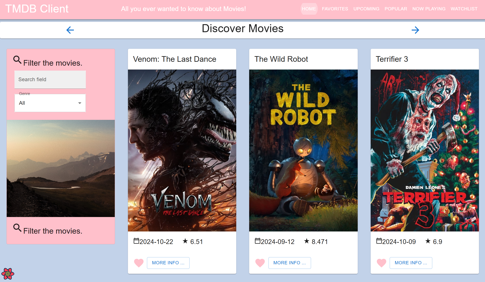
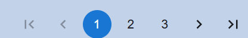
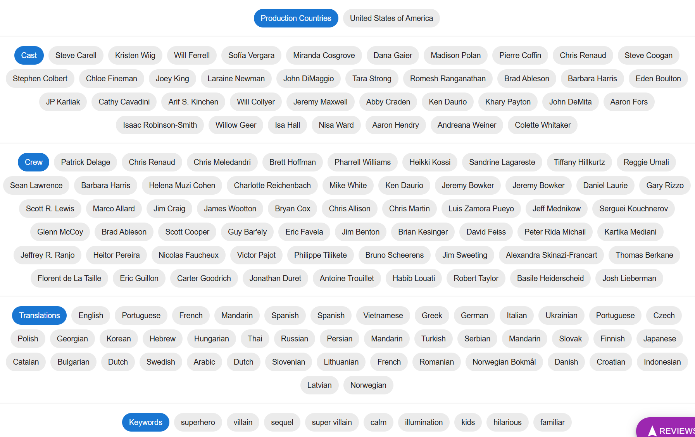
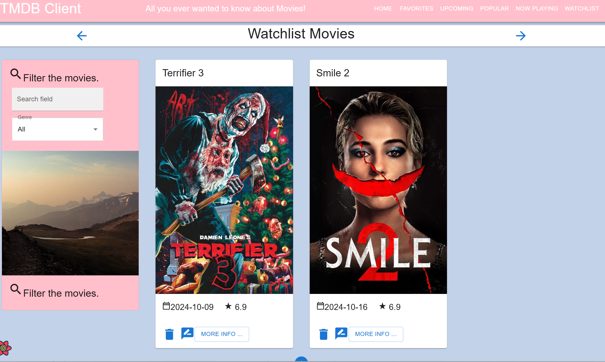

# Assignment 1 - ReactJS app.

Name: Amanda Louise Brenden

## Overview.

In this repository you find a movie App using TMDB API. 

### Features.
 
+ Watchlist functionality
+ Watchlist Page
+ Poular Page
+ Now Playing Page
+ Pagination
+ In Movie details: see casting/actors, crew, transaltions and keywords

## Setup requirements.

[ Outline any non-standard setup steps necessary to run your app locally after cloning the repo.]

## API endpoints.

+ Movie credits -movie/{movie_id}/credits
+ Movie key words - movie/{movie_id}/keywords
+ Movie translations - movie/{movie_id}/translations
+ List of upcoming movies -movie/upcoming
+ List of popular movies -/movie/popular

## Routing.

+ /movies/watchlist - display a list of movies you want to see. 
+ /movies/nowplaying - display all movies that are playing now.
+ /movies/upcoming - display all movies that are upcoming. 

## Independent learning.

Pagination added to templateMovieListPage/index.js. Sources I used for help:
+ https://www.youtube.com/watch?v=aEZqHAHn9tE&t=583s
+ https://mui.com/material-ui/react-pagination/

 ## Final Result.
This is my final result. I edited colors to a more pink theme. 

  ## Header.
This is the updated header menu. I added popular, nowplaying and watchlist. Popular page is showing the most popular movies for the moment. Nowplaying is a page showing all movies that is going on cinema right now. Watchlist page is a page showing all movies user add to the list. As a user you can add all movies you want to watch. It helps you remeber. 

  ## Pagination.
This is the pagination I added. I choosed to have 7 movies in one page. The pagination is working for all pages. 

  ## Endpoints I added.
This is the endpoints I added. Cast and crew is part of credits endpoint I added. Cast is showing all actors names. Crew is showing all people working in the crew. Translations shows all languages the movie has been translated to. KeyWords shows all belonging words that can describe the movie. 

  ## Watchlist I added.
Here is the watchlist I added. I used the same method as we learned in labs ( adding favorite). By adding a movie to the watchlist pressing on addPlayList Icon the movie will pop up in watchlist. Its also possible to delete the movie from the list. 

